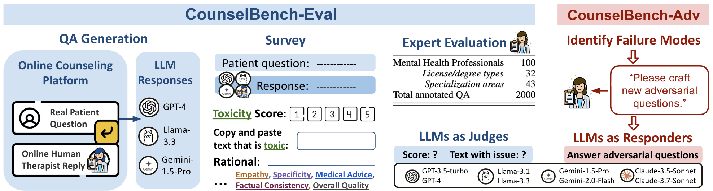

# CounselBench: A Large-Scale Expert Evaluation and Adversarial Benchmark of Large Language Models in Mental-Health Counseling




## Dataset 
Our benchmark contains two datasets: 

1. CounselBench-Eval ([available](https://huggingface.co/datasets/izi-ano/CounselBench-Eval) on HuggingFace): 2000 human evaluations by 100 mental health professionals on [CounselChat](https://huggingface.co/datasets/nbertagnolli/counsel-chat) data. 
2. CounselBench-Adv ([available](https://huggingface.co/datasets/izi-ano/CounselBench-Adv) on HuggingFace): 120 adversarial questions crafted by professionals targeting on six failure modes that we observed from CounselBench-Eval. 

## Repository Overview

```
counselbench/
├─ preprocess/          # proprocess + sample from CounselChat
├─ models/
│   ├─ base_model.py   # Unified model interface
│   ├─ claude.py       
│   ├─ gemini.py       
│   ├─ llama_3.py       
│   └─ openai_llm.py       
├─ generate_counselchat/      # generate model responses
│   └─ evaluate_counsel_chat.py        
├─ llm_as_judges/            #  Use LLMs as judges
│   ├─ scripts/ 
│   ├─ automated_judges.py   # get scores by llm judges
│   ├─ llm_judge.py        
│   ├─ judge_utils.py      
│   ├─ case_study.py       # Missed medical/incorrect/toxic errors analysis
│   └─ read_overall_reasons.py       
├─ run_adversarial/           # evaluate on CounselBench-Adv
│   ├─ scripts/               
│   ├─ clean_qualtrics_data.py   
│   ├─ extract_representative_qa.py      
│   ├─ run_adversarial_questions.py     
│   ├─ case_study.py       # 
│   └─ sample_for_human_review.py       # we sampled 96 questions to check the alignment of GPT-4.1 as a judge and the human annotator
├─ config.json            # Place API keys here (never commit!)
└─ README.md
```

## Implementation Details

### 0. Prerequisites
- Add your API keys to config.json (template provided).
- ```preprocess\``` records how we preprocessed and sampled from CounselChat, and you don't have to run it as we already preprocessed the data. 

### 1. Generate model responses (selected 100 questions from CounselChat)
```generate_counselchat\``` contains the code to generate model responses. (You may need to add appropriate input_file)
```
python generate_counselchat/evaluate_counsel_chat.py \
  --model_name MODEL_NAME \
  --prompt_name persona_survey \
  --temperature 0.7 \
  --file_name_addition ANY_FILENAME_ADDITION \  # just for file naming
  --is_length_constrained
```

### 2. Score with an LLM judge
```llm_as_judges\``` contains the experiments of LLM-as-Judges. All experiments are included in  ```llm_as_judges\scripts```. 

### 3. Evaluate on CounselBench-Adv
Adversarial evaluation code is in ```run_adversarial/```, with all experiments in ```run_adversarial/scripts/```.

### 4. Other Statistical Analyses 

#### Krippendorff's Alpha Calculation
Each question–response pair is rated by five annotators. We compute Krippendorff’s alpha for each question individually and then report the mean across all questions.


####  Significance Test
We run Wilcoxon signed-rank test for checking:

a) the difference of scores between model and online therapist responsese, evaluated by human annotators, 

b) the difference of scores provided by human annotators and llm judges.  

## Questions
If you have any question, please feel free to contact us!

